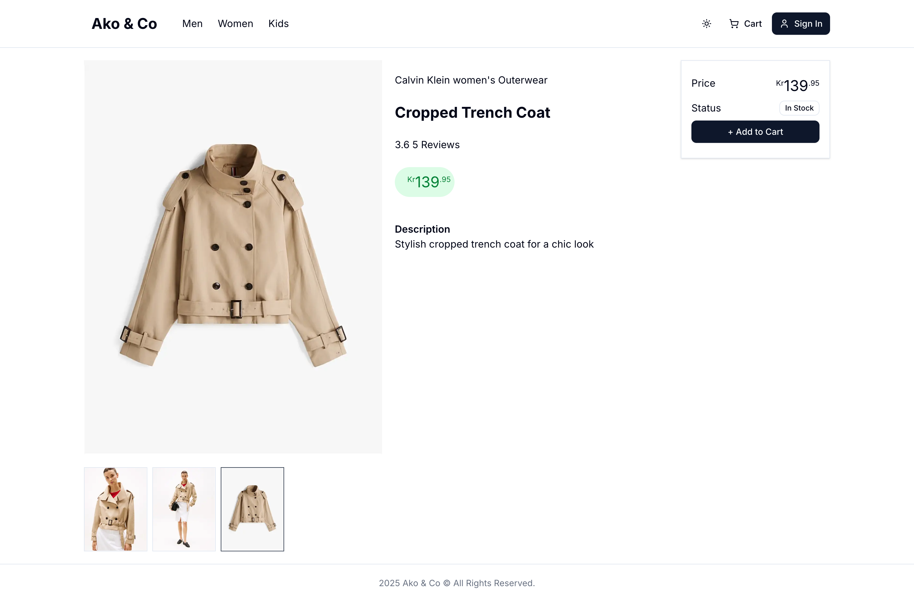

## Ako & Co E-commerce

  
  

A modern, full-stack e-commerce platform built with Next.js 15, React 19, TypeScript, PostgreSQL, and Prisma.

Note: This project is currently under active development and is not yet complete. Features and documentation will be updated as development progresses.

## Overview

Ako & Co is a fashion e-commerce website offering a curated selection of high-quality clothing for men, women, and kids. This platform provides a seamless shopping experience with features like product browsing, cart functionality, user authentication, and secure checkout.

## Tech Stack

### Frontend:

Next.js 15 (App Router)
React 19
TypeScript
Tailwind CSS

### Backend:

Next.js API Routes
PostgreSQL
Prisma ORM

### Authentication:

NextAuth.js

### Payment Processing:

Stripe API
