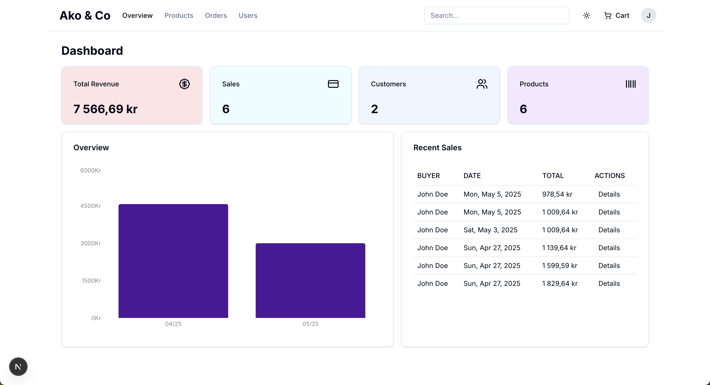

## Ako & Co E-commerce

  
   
  
   
   

A modern, full-stack e-commerce platform built with Next.js 15, React 19, TypeScript, PostgreSQL, and Prisma.

Note: This project is currently under active development and is not yet complete. Features and documentation will be updated as development progresses.

## Overview

Ako & Co is a fashion e-commerce website offering a curated selection of high-quality clothing for men, women, and kids. This platform provides a seamless shopping experience with features like product browsing, cart functionality, user authentication, and secure checkout.

## Tech Stack

### Frontend:

- Next.js 15
- React 19
- TypeScript
- Shadcn/ui
- Tailwind CSS

### Backend:

- Next.js API Routes
- PostgreSQL
- Prisma ORM

### Authentication:

- NextAuth.js

### Payment Processing:

- Stripe API

## Key Features

### Authentication With Next Auth
A complete authentication system built with Next Auth library providing secure user registration, login, and session management.

### Add To Cart
Robust cart system with database and session integration allowing users to add products, update quantities, and persist carts across sessions.

### Cart & Shipping Page
Streamlined checkout process beginning with a comprehensive cart summary page and user-friendly shipping address form.

### Payment Method & Order Pages
Complete checkout flow with payment method selection and detailed order confirmation pages.

### PayPal Payments
Fully integrated PayPal API for secure payment processing with unit testing using JEST to ensure reliability.

### Order History & User Profile
Personalized user area featuring order history listing and profile management capabilities.

### Admin Dashboard
Comprehensive admin control panel with:
* Overview analytics page
* Order management system
* More admin features in development 
